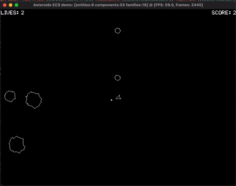
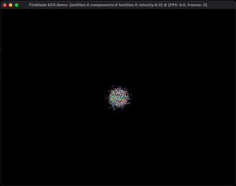

# Fireblade ECS Demo

		 

A minimal demo App for the [Fireblade Entity-Component-System](https://github.com/fireblade-engine/ecs). 
This App demonstrates handling of Entities and Components and provides a live Performance Test  for the framework.

# Getting Started

These instructions will get you a copy of the project up and running on your local machine.

## Prerequisites

- [Swift Package Manager (SPM)](https://github.com/apple/swift-package-manager)
- [Xcode 12+](https://developer.apple.com/xcode/)
- [Simple DirectMedia Layer 2 (SDL2)](https://www.libsdl.org/download-2.0.php)
	- Download and install i.e. via [Homebrew](https://brew.sh)   
		`brew install sdl2`

## Installing

1. Clone the repository 
2. Either open `Package.swift` with Xcode and run one of the executable schemes  
	-or-
3. From Terminal run `make runAsteroids` or `make runParticles` to run either demo.   

## Authors

* [Christian Treffs](https://github.com/ctreffs) - *Initial work*
* [Igor Kravchenko](https://github.com/igorkravchenko) - *Asteroids demo*

## License

This project is licensed under the MIT License - see the [LICENSE](LICENSE) file for details
